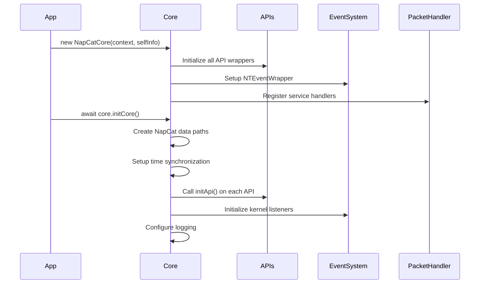

## Core Architecture

NapCat is built on a modular architecture that wraps NTQQ (the native QQ protocol client) with a clean API layer. The architecture consists of several key components working together to provide a stable bot framework.

### NapCatCore Class

The `NapCatCore` class is the heart of NapCat, managing all core functionality and API services.

```typescript
export class NapCatCore {
  readonly context: InstanceContext;
  readonly eventWrapper: NTEventWrapper;
  event = appEvent;
  apis: StableNTApiWrapper;
  selfInfo: SelfInfo;
  util: NodeQQNTWrapperUtil;
  configLoader: NapCatConfigLoader;
}
```

**Key responsibilities:**
- Initialize and manage API wrappers
- Handle event system lifecycle
- Manage configuration and logging
- Coordinate packet handling
- Maintain self information and online status

Source: `packages/napcat-core/index.ts:113`

### InstanceContext

The `InstanceContext` interface provides runtime dependencies to all components:

```typescript
export interface InstanceContext {
  readonly workingEnv: NapCatCoreWorkingEnv;
  readonly wrapper: WrapperNodeApi;
  readonly session: NodeIQQNTWrapperSession;
  readonly logger: LogWrapper;
  readonly basicInfoWrapper: QQBasicInfoWrapper;
  readonly pathWrapper: NapCatPathWrapper;
  readonly packetHandler: NativePacketHandler;
  readonly napi2nativeLoader: Napi2NativeLoader;
}
```

This design ensures:
- Clean dependency injection
- Consistent access to shared resources
- Environment-aware behavior
- Easy testing and mocking

Source: `packages/napcat-core/index.ts:332`

## API Wrappers

<CardGroup cols={2}>
  <Card title="NTQQMsgApi" icon="message">
    Message sending, receiving, recall, multi-message, emoji reactions
  </Card>
  <Card title="NTQQGroupApi" icon="users">
    Group management, member operations, file handling, notifications
  </Card>
  <Card title="NTQQFriendApi" icon="user">
    Friend list, requests, profile management
  </Card>
  <Card title="NTQQUserApi" icon="id-card">
    User info, UID/UIN conversion, profile details
  </Card>
  <Card title="NTQQFileApi" icon="file">
    File uploads, downloads, image/video handling
  </Card>
  <Card title="NTQQSystemApi" icon="cog">
    System utilities, status, platform info
  </Card>
  <Card title="NTQQPacketApi" icon="network-wired">
    Low-level packet sending and protocol access
  </Card>
  <Card title="NTQQDatabaseApi" icon="database">
    SQLite database access with encryption support
  </Card>
</CardGroup>

All API wrappers are initialized in the `NapCatCore` constructor:

```typescript
this.apis = {
  FileApi: new NTQQFileApi(this.context, this),
  SystemApi: new NTQQSystemApi(this.context, this),
  PacketApi: new NTQQPacketApi(this.context, this),
  WebApi: new NTQQWebApi(this.context, this),
  FriendApi: new NTQQFriendApi(this.context, this),
  MsgApi: new NTQQMsgApi(this.context, this),
  UserApi: new NTQQUserApi(this.context, this),
  GroupApi: new NTQQGroupApi(this.context, this),
  FlashApi: new NTQQFlashApi(this.context, this),
  OnlineApi: new NTQQOnlineApi(this.context, this),
  DatabaseApi: new NTQQDatabaseApi(this.context, this),
};
```

Source: `packages/napcat-core/index.ts:144`

### Example: NTQQMsgApi

The Message API provides comprehensive message handling:

```typescript
export class NTQQMsgApi {
  context: InstanceContext;
  core: NapCatCore;

  // Send messages
  async sendMsg(peer: Peer, elements: SendMessageElement[], timeout?: number)

  // Get messages
  async getMsgsByMsgId(peer: Peer, msgIds: string[])
  async getMultiMsg(peer: Peer, rootMsgId: string, parentMsgId: string)

  // Emoji reactions
  async setEmojiLike(peer: Peer, msgSeq: string, emojiId: string, set: boolean)
  async getMsgEmojiLikesList(peer: Peer, msgSeq: string, emojiId: string)

  // Forward and recall
  async ForwardMsg(peer: Peer, msgIds: string[])
  async recallMsg(peer: Peer, msgIds: string[])
}
```

Source: `packages/napcat-core/apis/msg.ts:5`

## Event System

NapCat uses a sophisticated event system built on multiple layers:

### NTEventWrapper

Wraps NTQQ's native event system with a Promise-based listener API:

```typescript
export class NTEventWrapper {
  // Register event listener with timeout and filter
  async registerListen<EventName>(
    eventName: string,
    filter: (payload: EventPayload) => boolean,
    count: number = 1,
    timeout: number = 5000
  ): Promise<EventPayload[]>
}
```

This allows waiting for specific events with conditions:

```typescript
const [msgs] = await core.eventWrapper.registerListen(
  'NodeIKernelMsgListener/onMsgInfoListUpdate',
  (msgList: RawMessage[]) => {
    return msgList.find(e => e.msgId === targetMsgId);
  },
  1,
  10000 // 10 second timeout
);
```

### TypedEventEmitter

Provides type-safe event emission throughout NapCat:

```typescript
export class TypedEventEmitter<Events extends Record<string, any>> {
  emit<K extends keyof Events>(event: K, data: Events[K]): void
  on<K extends keyof Events>(event: K, listener: (data: Events[K]) => void): void
}
```

Used for high-level events like:
- `KickedOffLine` - Bot was kicked offline
- `PacketReceived` - Protocol packet received
- Custom packet events from services

Source: `packages/napcat-core/packet/handler/typeEvent.ts`

### Kernel Listeners

NapCat registers listeners with NTQQ's kernel services:

```typescript
const msgListener = new NodeIKernelMsgListener();

msgListener.onRecvMsg = (msgs: RawMessage[]) => {
  msgs.forEach(msg => this.context.logger.logMessage(msg, this.selfInfo));
};

msgListener.onKickedOffLine = (Info: KickedOffLineInfo) => {
  this.selfInfo.online = false;
  this.event.emit('KickedOffLine', tips);
};

this.context.session.getMsgService().addKernelMsgListener(
  proxiedListenerOf(msgListener, this.context.logger)
);
```

Source: `packages/napcat-core/index.ts:225`

## Packet Handler

The `NativePacketHandler` provides low-level protocol packet interception:

<Note>
  Packet handling requires native modules and may not be available on all platforms.
</Note>

### Features

- **Bidirectional monitoring**: Intercept both sent and received packets
- **Flexible filtering**: Listen by packet type, command, or exact match
- **One-time listeners**: Support for single-use event handlers
- **Type safety**: Full TypeScript support

### Listener API

```typescript
export class NativePacketHandler {
  // Listen to all packets
  onAll(callback: PacketCallback): () => void

  // Listen by type (0=send, 1=recv)
  onType(type: PacketType, callback: PacketCallback): () => void
  onSend(callback: PacketCallback): () => void
  onRecv(callback: PacketCallback): () => void

  // Listen by command name
  onCmd(cmd: string, callback: PacketCallback): () => void

  // Exact match (type + cmd)
  onExact(type: PacketType, cmd: string, callback: PacketCallback): () => void

  // One-time listeners
  onceCmd(cmd: string, callback: PacketCallback): () => void
  onceExact(type: PacketType, cmd: string, callback: PacketCallback): () => void
}
```

Source: `packages/napcat-core/packet/handler/client.ts:28`

### Example Usage

```typescript
// Listen for database passphrase packet
nativePacketHandler.onCmd('OidbSvcTrpcTcp.0xcde_2', ({ type, hex_data }) => {
  if (type !== 1) return; // Only handle received packets
  
  const raw = Buffer.from(hex_data, 'hex');
  const base = new NapProtoMsg(OidbSvcTrpcTcpBase).decode(raw);
  if (base.body && base.body.length > 0) {
    const body = new NapProtoMsg(OidbSvcTrpcTcp0XCDE_2RespBody).decode(base.body);
    if (body.inner?.value) {
      dbPassphrase = body.inner.value;
      logger.log('[NapCat] Database support enabled');
    }
  }
});
```

Source: `packages/napcat-framework/napcat.ts:68`

## Service Registry

NapCat uses dependency injection for packet service handlers:

```typescript
import { container, ReceiverServiceRegistry } from './packet/handler/serviceRegister';

container.bind(NapCatCore).toConstantValue(this);
container.bind(TypedEventEmitter).toConstantValue(this.event);

ReceiverServiceRegistry.forEach((ServiceClass, serviceName) => {
  container.bind(ServiceClass).toSelf();
  this.context.packetHandler.onCmd(serviceName, ({ seq, hex_data }) => {
    const serviceInstance = container.get(ServiceClass);
    return serviceInstance.handler(seq, hex_data);
  });
});
```

This pattern enables:
- Automatic service registration
- Clean separation of concerns
- Easy testing and mocking
- Protocol version compatibility

Source: `packages/napcat-core/index.ts:158`

## Initialization Flow



The initialization process:

1. **Constructor phase**: Create API wrappers, bind services
2. **initCore phase**: Setup filesystem, sync time, init APIs, register listeners
3. **Ready**: System is ready to handle messages and events

Source: `packages/napcat-core/index.ts:170`

## Best Practices

<AccordionGroup>
  <Accordion title="Use InstanceContext for shared resources">
    Always access logger, session, and paths through `context` rather than global variables.
    
    ```typescript
    // Good
    this.context.logger.log('Message');
    
    // Bad
    console.log('Message');
    ```
  </Accordion>

  <Accordion title="Handle async operations properly">
    NTQQ APIs are async and may timeout. Always use try-catch and timeouts.
    
    ```typescript
    try {
      const result = await core.apis.MsgApi.sendMsg(peer, elements, 5000);
    } catch (error) {
      logger.logError('Send failed:', error);
    }
    ```
  </Accordion>

  <Accordion title="Register packet listeners early">
    Some packets (like database passphrase) are only sent during login. Register handlers before `initCore()`.
    
    ```typescript
    // Register before login
    packetHandler.onCmd('OidbSvcTrpcTcp.0xcde_2', handler);
    
    // Then initialize
    await core.initCore();
    ```
  </Accordion>

  <Accordion title="Clean up event listeners">
    Always store and clean up listener removal functions to prevent memory leaks.
    
    ```typescript
    const removeListener = packetHandler.onCmd('command', callback);
    // Later...
    removeListener();
    ```
  </Accordion>
</AccordionGroup>

## Related

<CardGroup cols={2}>
  <Card title="Working Environments" icon="layer-group" href="/concepts/working-environments">
    Learn about Shell vs Framework modes
  </Card>
  <Card title="OneBot Protocol" icon="robot" href="/concepts/onebot-protocol">
    Understand the OneBot 11 implementation
  </Card>
  <Card title="Adapters" icon="plug" href="/concepts/adapters">
    Configure network adapters
  </Card>
</CardGroup>