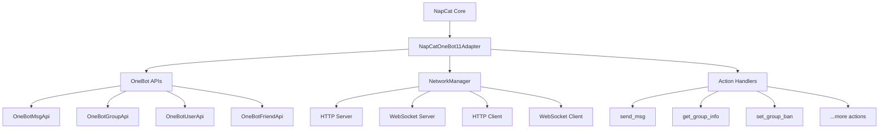

## What is OneBot?

OneBot is a standardized chatbot protocol designed to provide a unified API interface for different chat platforms. NapCat implements the OneBot 11 standard to expose QQ bot functionality through HTTP, WebSocket, and other network protocols.

<Info>
  OneBot 11 is the most widely supported version, compatible with most bot frameworks and libraries in the ecosystem.
</Info>

## Architecture

### NapCatOneBot11Adapter

The OneBot implementation is packaged as an adapter that wraps `NapCatCore`:

```typescript
export class NapCatOneBot11Adapter {
  readonly core: NapCatCore;
  readonly context: InstanceContext;
  
  configLoader: OB11ConfigLoader;
  apis: ApiListType;
  networkManager: OB11NetworkManager;
  actions: ActionMap;
}
```

Source: `packages/napcat-onebot/index.ts:69`

**Key components:**
- **Core**: Access to NapCat's native QQ APIs
- **APIs**: OneBot-specific API implementations
- **NetworkManager**: Manages all network adapters (HTTP/WS/etc)
- **Actions**: Maps OneBot actions to handler functions

### Component Diagram



## Action & Event Model

### Actions (Requests)

Actions are requests sent **to** the bot to perform operations. They follow this structure:

```json
{
  "action": "send_msg",
  "params": {
    "message_type": "group",
    "group_id": 123456789,
    "message": "Hello World"
  }
}
```

### Events (Push)

Events are pushed **from** the bot when something happens. Event types:

```typescript
export enum EventType {
  META = 'meta_event',        // Heartbeat, lifecycle
  REQUEST = 'request',         // Friend/group requests
  NOTICE = 'notice',          // Notifications (kick, recall, etc)
  MESSAGE = 'message',         // Incoming messages
  MESSAGE_SENT = 'message_sent' // Self-sent messages
}
```

Source: `packages/napcat-onebot/event/OneBotEvent.ts:3`

### Event Base Structure

```typescript
export abstract class OneBotEvent {
  time = Math.floor(Date.now() / 1000);
  self_id: number;
  abstract post_type: EventType;

  constructor(core: NapCatCore) {
    this.self_id = parseInt(core.selfInfo.uin);
  }
}
```

All OneBot events extend this base class and include:
- `time`: Unix timestamp
- `self_id`: Bot's QQ number
- `post_type`: Event category

Source: `packages/napcat-onebot/event/OneBotEvent.ts:11`

## Message Format

OneBot 11 supports two message formats:

### Array Format (Recommended)

```json
{
  "message_type": "group",
  "group_id": 123456789,
  "user_id": 987654321,
  "message": [
    {"type": "text", "data": {"text": "Hello "}},
    {"type": "at", "data": {"qq": "123456"}},
    {"type": "image", "data": {"file": "file:///path/to/image.jpg"}}
  ]
}
```

### String Format (CQ Code)

```json
{
  "message_type": "group",
  "group_id": 123456789,
  "user_id": 987654321,
  "message": "Hello [CQ:at,qq=123456] [CQ:image,file=file:///path/to/image.jpg]"
}
```

<Tip>
  You can configure which format to use in the adapter configuration with `messagePostFormat: "array"` or `"string"`.
</Tip>

### Message Elements

Common message element types:

<AccordionGroup>
  <Accordion title="Text" icon="font">
    ```json
    {"type": "text", "data": {"text": "Plain text content"}}
    ```
  </Accordion>

  <Accordion title="At" icon="at">
    ```json
    {"type": "at", "data": {"qq": "123456"}}
    {"type": "at", "data": {"qq": "all"}}
    ```
  </Accordion>

  <Accordion title="Image" icon="image">
    ```json
    {"type": "image", "data": {
      "file": "file:///path/to/image.jpg",
      "type": "flash",
      "summary": "Image description"
    }}
    ```
  </Accordion>

  <Accordion title="Face" icon="smile">
    ```json
    {"type": "face", "data": {"id": "123"}}
    ```
  </Accordion>

  <Accordion title="Record (Voice)" icon="microphone">
    ```json
    {"type": "record", "data": {
      "file": "file:///path/to/audio.mp3"
    }}
    ```
  </Accordion>

  <Accordion title="Video" icon="video">
    ```json
    {"type": "video", "data": {
      "file": "file:///path/to/video.mp4"
    }}
    ```
  </Accordion>

  <Accordion title="Reply" icon="reply">
    ```json
    {"type": "reply", "data": {"id": "message_id"}}
    ```
  </Accordion>
</AccordionGroup>

## Action Implementation

Actions are implemented using a registry pattern:

```typescript
export function createActionMap(
  obContext: NapCatOneBot11Adapter,
  core: NapCatCore
): ActionMap {
  // Auto-discover and register all action handlers
  const actionMap = new Map<string, BaseAction<any, any>>();
  
  // Example actions:
  actionMap.set('send_msg', new SendMsgAction(obContext, core));
  actionMap.set('get_group_info', new GetGroupInfoAction(obContext, core));
  actionMap.set('set_group_ban', new SetGroupBanAction(obContext, core));
  
  return actionMap;
}
```

Source: `packages/napcat-onebot/action/index.ts`

### Action Handler Example

Here's how an action handler is structured:

```typescript
export class SendMsgAction extends BaseAction<SendMsgParams, SendMsgResponse> {
  actionName = 'send_msg';
  
  async _handle(payload: SendMsgParams): Promise<SendMsgResponse> {
    const { message_type, user_id, group_id, message } = payload;
    
    // Convert OneBot message format to NapCat format
    const peer: Peer = {
      chatType: message_type === 'group' ? ChatType.KCHATTYPEGROUP : ChatType.KCHATTYPEC2C,
      peerUid: message_type === 'group' ? String(group_id) : await this.getUidByUin(String(user_id)),
      guildId: '',
    };
    
    const elements = await this.obContext.apis.MsgApi.createSendElements(message);
    const result = await this.core.apis.MsgApi.sendMsg(peer, elements);
    
    return {
      message_id: result.msgId,
    };
  }
}
```

## Event Handling

### Message Events

Incoming messages are processed and converted to OneBot format:

```typescript
msgListener.onRecvMsg = async (msgs) => {
  for (const m of msgs) {
    // Skip messages older than boot time
    if (this.bootTime > parseInt(m.msgTime)) {
      continue;
    }
    
    // Convert RawMessage to OneBot format
    const ob11Msg = await this.apis.MsgApi.parseMessageV2(
      m, 
      this.configLoader.configData.parseMultMsg
    );
    
    if (ob11Msg) {
      // Emit to all active network adapters
      await this.networkManager.emitEvent(ob11Msg);
    }
  }
};
```

Source: `packages/napcat-onebot/index.ts:309`

### Notice Events

System events like group member changes, kicks, recalls:

```typescript
// Group member increase
const event = new OB11GroupIncreaseEvent(
  this.core,
  groupId,
  userId,
  operatorId,
  'approve' // or 'invite'
);
await this.networkManager.emitEvent(event);

// Message recall
const recallEvent = new OB11GroupRecallNoticeEvent(
  this.core,
  groupId,
  userId,
  operatorId,
  messageId
);
await this.networkManager.emitEvent(recallEvent);
```

### Request Events

Friend and group requests:

```typescript
// Friend request
const event = new OB11FriendRequestEvent(
  this.core,
  requesterUin,
  comment,
  flag // Request ID for approval/rejection
);

// Group request (join or invite)
const event = new OB11GroupRequestEvent(
  this.core,
  groupId,
  userId,
  'add', // or 'invite'
  comment,
  flag
);
```

Source: `packages/napcat-onebot/index.ts:436`

## Network Manager

The `OB11NetworkManager` handles event distribution to all active adapters:

```typescript
export class OB11NetworkManager {
  adapters: Map<string, IOB11NetworkAdapter<NetworkAdapterConfig>> = new Map();

  async emitEvent(event: OneBotEvent | OB11Message) {
    return Promise.all(
      Array.from(this.adapters.values()).map(async adapter => {
        if (adapter.isActive) {
          return await adapter.onEvent(event);
        }
      })
    );
  }

  registerAdapter(adapter: IOB11NetworkAdapter) {
    this.adapters.set(adapter.name, adapter);
  }
}
```

Source: `packages/napcat-onebot/network/index.ts:15`

### Network Adapters

Supported adapter types:

<CardGroup cols={2}>
  <Card title="HTTP Server" icon="server">
    Listens for POST requests with actions
  </Card>
  <Card title="WebSocket Server" icon="plug">
    Bidirectional communication, client connects to bot
  </Card>
  <Card title="HTTP Client" icon="arrow-up">
    Posts events to remote URL (reverse HTTP)
  </Card>
  <Card title="WebSocket Client" icon="arrow-right">
    Connects to remote WS server (reverse WS)
  </Card>
</CardGroup>

Each adapter can be independently enabled/disabled in configuration.

## Configuration

OneBot configuration is loaded via `OB11ConfigLoader`:

```typescript
interface OneBotConfig {
  network: {
    httpServers: HttpServerConfig[];
    httpClients: HttpClientConfig[];
    websocketServers: WebSocketServerConfig[];
    websocketClients: WebSocketClientConfig[];
    httpSseServers: HttpSSEServerConfig[];
  };
  parseMultMsg: boolean;
  messagePostFormat: 'string' | 'array';
  reportSelfMessage: boolean;
  debug: boolean;
}
```

Source: `packages/napcat-onebot/config/config.ts`

### Example Configuration

```json
{
  "network": {
    "httpServers": [
      {
        "name": "http-server-1",
        "enable": true,
        "host": "127.0.0.1",
        "port": 3000,
        "secret": "your_secret_token",
        "messagePostFormat": "array"
      }
    ],
    "websocketServers": [
      {
        "name": "ws-server-1",
        "enable": true,
        "host": "127.0.0.1",
        "port": 3001
      }
    ]
  },
  "reportSelfMessage": false,
  "parseMultMsg": true
}
```

## Common Actions

<AccordionGroup>
  <Accordion title="send_msg - Send message">
    ```json
    {
      "action": "send_msg",
      "params": {
        "message_type": "group",
        "group_id": 123456789,
        "message": "Hello World"
      }
    }
    ```
  </Accordion>

  <Accordion title="delete_msg - Recall message">
    ```json
    {
      "action": "delete_msg",
      "params": {
        "message_id": 123456
      }
    }
    ```
  </Accordion>

  <Accordion title="get_group_info - Get group info">
    ```json
    {
      "action": "get_group_info",
      "params": {
        "group_id": 123456789,
        "no_cache": false
      }
    }
    ```
  </Accordion>

  <Accordion title="set_group_ban - Ban group member">
    ```json
    {
      "action": "set_group_ban",
      "params": {
        "group_id": 123456789,
        "user_id": 987654321,
        "duration": 600
      }
    }
    ```
  </Accordion>

  <Accordion title="get_login_info - Get bot info">
    ```json
    {
      "action": "get_login_info",
      "params": {}
    }
    ```
  </Accordion>
</AccordionGroup>

## Extension: Quick Actions

NapCat extends OneBot with quick action support for rapid responses:

```json
{
  ".handle_quick_operation": {
    "context": { /* original event */ },
    "operation": {
      "reply": "Quick reply text",
      "delete": false,
      "kick": false,
      "ban": false,
      "ban_duration": 0
    }
  }
}
```

Quick actions allow responding to events without separate API calls.

Source: `packages/napcat-onebot/api/quick-action.ts`

## Related

<CardGroup cols={2}>
  <Card title="Adapters" icon="plug" href="/concepts/adapters">
    Configure HTTP and WebSocket adapters
  </Card>
  <Card title="Architecture" icon="sitemap" href="/concepts/architecture">
    Understand the core architecture
  </Card>
  <Card title="API Reference" icon="code" href="/api/onebot/overview">
    Full action and event reference
  </Card>
</CardGroup>