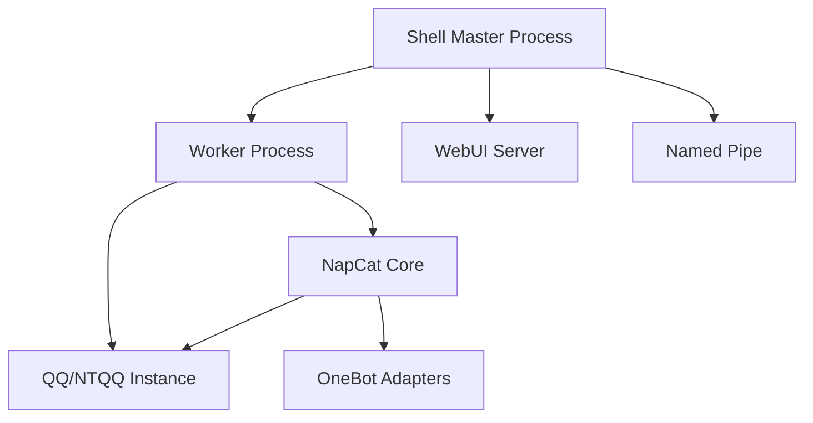
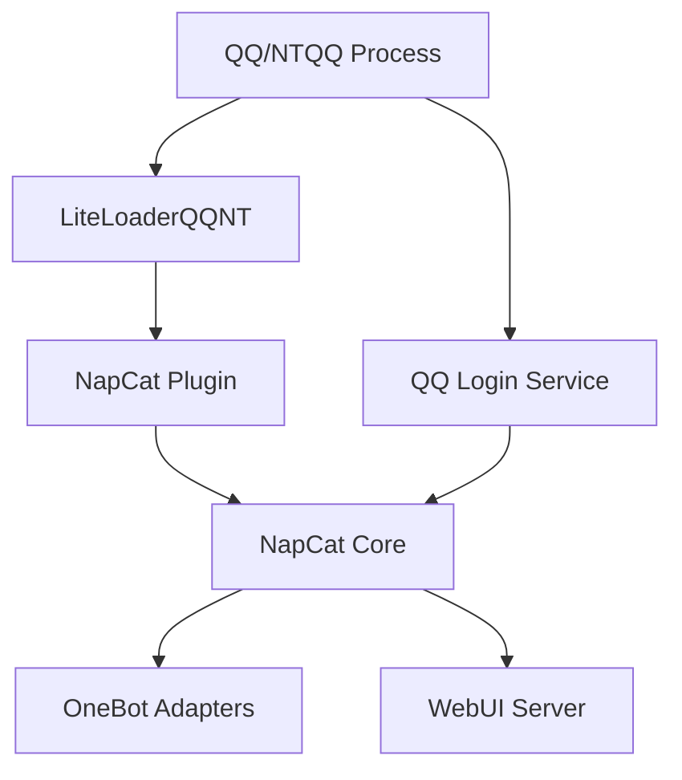

## Overview

NapCat supports two distinct working environments, each designed for different deployment scenarios. The environment is determined by how NapCat is launched and integrated with NTQQ.

```typescript
export enum NapCatCoreWorkingEnv {
  Unknown = 0,
  Shell = 1,
  Framework = 2,
}
```

Source: `packages/napcat-core/index.ts:56`

<CardGroup cols={2}>
  <Card title="Shell Mode" icon="terminal">
    Standalone process that launches and controls QQ
  </Card>
  <Card title="Framework Mode" icon="layer-group">
    Injected into existing QQ process as a plugin
  </Card>
</CardGroup>

## Shell Mode

### What is Shell Mode?

Shell mode runs NapCat as an **independent process** that:
- Launches QQ as a child process
- Manages the QQ lifecycle
- Handles multi-process coordination
- Provides process isolation and crash recovery

### Architecture



### Process Management

Shell mode uses a master-worker pattern for stability:

```typescript
// Environment detection
const ENV = {
  isWorkerProcess: process.env['NAPCAT_WORKER_PROCESS'] === '1',
  isMultiProcessDisabled: process.env['NAPCAT_DISABLE_MULTI_PROCESS'] === '1',
  isPipeDisabled: process.env['NAPCAT_DISABLE_PIPE'] === '1',
};

// Master process
async function startMasterProcess() {
  // Connect named pipe for IPC
  await connectToNamedPipe(logger);
  
  // Start worker process
  await startWorker();
  
  // Handle graceful shutdown
  process.on('SIGINT', shutdown);
  process.on('SIGTERM', shutdown);
}

// Worker process
async function startWorkerProcess() {
  // Listen for parent messages
  processManager.onParentMessage((msg) => {
    if (msg.type === 'restart-prepare' || msg.type === 'shutdown') {
      process.exit(0);
    }
  });
  
  // Initialize NapCat core
  await NCoreInitShell();
}
```

Source: `packages/napcat-shell/napcat.ts:334`

### Crash Recovery

Shell mode includes automatic crash recovery:

```typescript
// Track recent crashes
const recentCrashTimestamps: number[] = [];
const CRASH_TIME_WINDOW = 10000; // 10 seconds
const MAX_CRASHES_IN_WINDOW = 3; // Maximum crashes before giving up

child.on('exit', (code) => {
  if (!isRestarting && !isShuttingDown) {
    const now = Date.now();
    
    // Clean old crash records
    while (recentCrashTimestamps.length > 0 && 
           now - recentCrashTimestamps[0] > CRASH_TIME_WINDOW) {
      recentCrashTimestamps.shift();
    }
    
    recentCrashTimestamps.push(now);
    
    if (recentCrashTimestamps.length >= MAX_CRASHES_IN_WINDOW) {
      logger.logError('Too many crashes, exiting');
      process.exit(1);
    }
    
    logger.logWarn('Worker crashed, restarting...');
    startWorker();
  }
});
```

Source: `packages/napcat-shell/napcat.ts:284`

### Restart Process

```typescript
export async function restartWorker(
  secretKey?: string, 
  port?: number
): Promise<void> {
  isRestarting = true;
  
  // 1. Notify old process to prepare for restart
  currentWorker?.postMessage({ type: 'restart-prepare' });
  
  // 2. Wait for graceful exit (5 seconds)
  await new Promise<void>((resolve) => {
    const timeout = setTimeout(() => {
      currentWorker?.postMessage({ type: 'shutdown' });
      setTimeout(() => {
        currentWorker?.kill();
        resolve();
      }, 2000);
    }, 5000);
    
    currentWorker?.once('exit', () => {
      clearTimeout(timeout);
      resolve();
    });
  });
  
  // 3. Force kill if still alive
  if (workerPid && isProcessAlive(workerPid)) {
    forceKillProcess(workerPid);
  }
  
  // 4. Wait and start new process
  await new Promise(resolve => setTimeout(resolve, 3000));
  await startWorker(false, secretKey, port);
  
  isRestarting = false;
}
```

Source: `packages/napcat-shell/napcat.ts:154`

### Features

<AccordionGroup>
  <Accordion title="Process Isolation" icon="shield">
    - Worker process crashes don't affect master
    - Master can restart worker automatically
    - Clean separation of concerns
  </Accordion>

  <Accordion title="Multi-Process Support" icon="copy">
    - Electron UtilityProcess on desktop
    - Node.js child_process.fork on CLI
    - Configurable via environment variables
  </Accordion>

  <Accordion title="Quick Login" icon="bolt">
    - Pass QQ number via `-q` or `--qq` argument
    - Automatically handles quick login flow
    - Preserved on first start only (not restarts)
  </Accordion>

  <Accordion title="Named Pipe IPC" icon="arrows-left-right">
    - Communicate with external processes
    - Can be disabled via `NAPCAT_DISABLE_PIPE=1`
    - Platform-specific pipe naming
  </Accordion>
</AccordionGroup>

### Use Cases

<Check>**Recommended for production deployments**</Check>

- Running NapCat as a system service
- Docker containers
- CLI environments
- Scenarios requiring automatic restart
- When you need full process control

### Launch Example

```bash
# Standard launch
napcat-shell

# With quick login
napcat-shell -q 123456789

# Disable multi-process
NAPCAT_DISABLE_MULTI_PROCESS=1 napcat-shell

# Single process mode (bypass master-worker)
NAPCAT_DISABLE_MULTI_PROCESS=1 NAPCAT_WORKER_PROCESS=1 napcat-shell
```

## Framework Mode

### What is Framework Mode?

Framework mode integrates NapCat **directly into the QQ process**:
- QQ is already running when NapCat starts
- NapCat is injected as a framework/plugin
- Shares the same process space as QQ
- Typically used with LiteLoaderQQNT or similar loaders

### Architecture



### Initialization Flow

```typescript
export async function NCoreInitFramework(
  session: NodeIQQNTWrapperSession,
  loginService: NodeIKernelLoginService,
  registerInitCallback: (callback: () => void) => void
) {
  const pathWrapper = new NapCatPathWrapper();
  const logger = new LogWrapper(pathWrapper.logsPath);
  
  // Load QQ wrapper from existing process
  const basicInfoWrapper = new QQBasicInfoWrapper({ logger });
  const wrapper = loadQQWrapper(
    basicInfoWrapper.QQMainPath,
    basicInfoWrapper.getFullQQVersion()
  );
  
  // Initialize packet handler
  const nativePacketHandler = new NativePacketHandler({ logger });
  await nativePacketHandler.init(
    basicInfoWrapper.getFullQQVersion(),
    napcatConfig.o3HookMode === 1
  );
  
  // Start WebUI early (before login)
  WebUiDataRuntime.setWorkingEnv(NapCatCoreWorkingEnv.Framework);
  InitWebUi(logger, pathWrapper, logSubscription, statusHelperSubscription);
  
  // Wait for login
  const selfInfo = await new Promise<SelfInfo>((resolve) => {
    const loginListener = new NodeIKernelLoginListener();
    
    loginListener.onQRCodeLoginSucceed = async (loginResult) => {
      await new Promise<void>(resolve => {
        registerInitCallback(() => resolve());
      });
      resolve({
        uid: loginResult.uid,
        uin: loginResult.uin,
        nick: '',
        online: true,
      });
    };
    
    loginService.addKernelLoginListener(
      proxiedListenerOf(loginListener, logger)
    );
  });
  
  // Initialize NapCat
  const framework = new NapCatFramework(
    wrapper, session, logger, selfInfo,
    basicInfoWrapper, pathWrapper,
    nativePacketHandler, napi2nativeLoader
  );
  await framework.core.initCore();
  
  // Initialize adapters
  const adapterManager = new NapCatAdapterManager(
    framework.core,
    framework.context,
    pathWrapper
  );
  await adapterManager.initAdapters();
}
```

Source: `packages/napcat-framework/napcat.ts:24`

### Login Handling

Framework mode provides rich login options through WebUI:

```typescript
const loginListener = new NodeIKernelLoginListener();

// QR Code login
loginListener.onQRCodeGetPicture = ({ qrcodeUrl }) => {
  WebUiDataRuntime.setQQLoginQrcodeURL(qrcodeUrl);
  logger.log('[Framework] QR code updated:', qrcodeUrl);
};

// Quick login (saved accounts)
WebUiDataRuntime.setQuickLoginCall(async (uin: string) => {
  const res = await loginService.quickLoginWithUin(uin);
  if (res.result === '0' && !res.loginErrorInfo?.errMsg) {
    WebUiDataRuntime.setQQLoginStatus(true);
    return { result: true, message: '' };
  }
  return { result: false, message: res.loginErrorInfo?.errMsg };
});

// Password login
WebUiDataRuntime.setPasswordLoginCall(async (uin, passwordMd5) => {
  const res = await loginService.passwordLogin({
    uin, passwordMd5, step: 0,
    newDeviceLoginSig: new Uint8Array(),
    proofWaterSig: new Uint8Array(),
    // ... other params
  });
  
  if (res.result === '140022008') {
    // Need captcha
    return { result: false, needCaptcha: true, proofWaterUrl: res.loginErrorInfo?.proofWaterUrl };
  } else if (res.result === '140022010' || res.result === '140022011') {
    // Need device verification
    return { result: false, needNewDevice: true, jumpUrl: res.loginErrorInfo?.jumpUrl };
  }
  
  return { result: res.result === '0', message: res.loginErrorInfo?.errMsg };
});
```

Source: `packages/napcat-framework/napcat.ts:200`

### Features

<AccordionGroup>
  <Accordion title="Early WebUI" icon="globe">
    - WebUI starts before login
    - Control login process via web interface
    - QR code display in browser
    - Multiple login methods (QR/password/quick)
  </Accordion>

  <Accordion title="Login History" icon="clock-rotate-left">
    - Access saved login accounts
    - Quick login with one click
    - Login list populated from QQ's database
  </Accordion>

  <Accordion title="Password Login" icon="key">
    - Full password login support
    - Captcha handling
    - Device verification
    - Multi-step authentication
  </Accordion>

  <Accordion title="Shared Process" icon="share-nodes">
    - Lower memory footprint
    - Direct access to QQ internals
    - No need to launch separate QQ
  </Accordion>
</AccordionGroup>

### Use Cases

<Check>**Recommended for desktop users**</Check>

- LiteLoaderQQNT plugin
- Desktop QQ with custom loaders
- Development and debugging
- When QQ UI is needed
- Scenarios where process injection is preferred

### Launch Example

Framework mode is typically launched by a plugin loader:

```javascript
// LiteLoaderQQNT plugin entry
export async function onBrowserWindowCreated(window) {
  // Wait for session ready
  const session = await getSession();
  const loginService = session.getLoginService();
  
  // Initialize NapCat framework
  await NCoreInitFramework(session, loginService, (callback) => {
    // Register callback for post-login initialization
    window.webContents.on('did-finish-load', callback);
  });
}
```

## Comparison Table

| Feature | Shell Mode | Framework Mode |
|---------|------------|----------------|
| **Process Model** | Separate master/worker | Injected into QQ |
| **Crash Recovery** | Automatic restart | Depends on QQ stability |
| **Memory Usage** | Higher (separate process) | Lower (shared process) |
| **QQ UI** | Can run headless | QQ UI available |
| **Login Methods** | Limited (QR/quick) | Full (QR/password/quick) |
| **WebUI Timing** | After login | Before login |
| **Deployment** | CLI, Docker, service | Desktop plugin |
| **Process Control** | Full control | Limited control |
| **Startup Speed** | Slower (launch QQ) | Faster (QQ already running) |
| **Isolation** | High | Low |

## Environment Detection

NapCat components can detect their working environment:

```typescript
const context: InstanceContext = {
  workingEnv: NapCatCoreWorkingEnv.Shell, // or Framework
  // ... other context properties
};

// Use in components
if (this.context.workingEnv === NapCatCoreWorkingEnv.Framework) {
  // Framework-specific behavior
  logger.log('Running in Framework mode');
} else if (this.context.workingEnv === NapCatCoreWorkingEnv.Shell) {
  // Shell-specific behavior
  logger.log('Running in Shell mode');
}
```

## Best Practices

<Tip>
  Choose Shell mode for production servers and Framework mode for desktop development.
</Tip>

<Warning>
  Framework mode shares QQ's process space. A crash in QQ will crash NapCat, and vice versa.
</Warning>

<Info>
  Both modes use the same NapCat Core APIs. Switching between modes doesn't require code changes.
</Info>

## Related

<CardGroup cols={2}>
  <Card title="Architecture" icon="sitemap" href="/concepts/architecture">
    Understand the core architecture
  </Card>
  <Card title="Adapters" icon="plug" href="/concepts/adapters">
    Configure network adapters
  </Card>
</CardGroup>