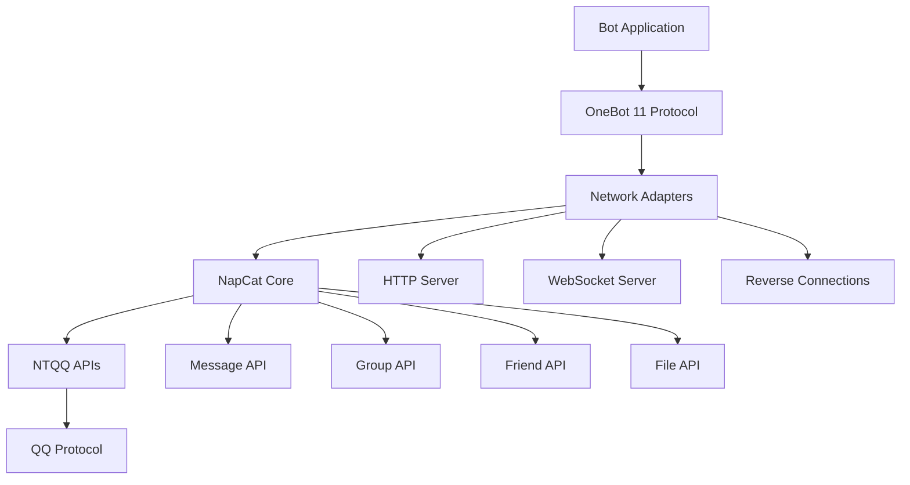

## What is NapCat?

NapCat is a modern protocol-side framework built on top of NTQQ (the new version of QQ) that enables developers to build powerful QQ bots using the OneBot 11 standard protocol. It provides a comprehensive set of APIs, multiple network adapters, and extensive customization options.

<CardGroup cols={2}>
  <Card title="Modern Architecture" icon="cube">
    Built on NTQQ with a clean, modular architecture separating core functionality from protocol adapters
  </Card>
  <Card title="OneBot 11 Standard" icon="plug">
    Full implementation of the OneBot 11 protocol for compatibility with existing bot frameworks
  </Card>
  <Card title="Multiple Adapters" icon="network-wired">
    Support for HTTP, WebSocket, reverse connections, and custom protocol adapters
  </Card>
  <Card title="Rich APIs" icon="code">
    Comprehensive APIs for messages, groups, friends, files, and system operations
  </Card>
</CardGroup>

## Key Features

NapCat provides everything you need to build production-ready QQ bots:

### Easy to Use
- Simple setup process with multiple deployment options
- Clear documentation and practical examples
- Built-in WebUI for management and monitoring
- Support for both beginners and advanced users

### Fast and Efficient
- Optimized for low-memory environments
- Can run for extended periods on resource-constrained systems
- Efficient message processing and event handling
- Minimal overhead compared to other solutions

### Rich API Interface
- Complete implementation of OneBot 11 standard actions
- Extended APIs for advanced features
- Native NTQQ APIs for low-level access
- Support for rich media (images, videos, audio, files)

### Stable and Reliable
- Active development and maintenance
- Community support through QQ groups
- Regular updates and bug fixes
- Production-tested by many users

## Architecture Overview

NapCat follows a layered architecture:

### Core Components

**NapCatCore**: The heart of the framework, managing:
- API wrappers for all NTQQ functionality
- Event system for handling incoming events
- Session management and authentication
- Configuration and logging

**Network Adapters**: Handle communication with bot applications:
- HTTP Server: RESTful API for action calls
- WebSocket Server: Bidirectional real-time communication
- HTTP/WebSocket Clients: Reverse connections to your server

**OneBot Protocol Layer**: Translates between:
- OneBot 11 standard actions/events
- Native NTQQ API calls and events

**Packet Handler**: For advanced users:
- Native packet inspection and modification
- Low-level protocol access
- Custom packet handlers

## Working Environments

NapCat supports two deployment modes:

### Shell Mode
Standalone process that manages QQ instances:
- Runs independently of QQ GUI
- Process management and crash recovery
- Suitable for headless servers
- Minimal resource usage

### Framework Mode
Plugin injected into running QQ instance:
- Works with existing QQ installation
- Rich login options (QR code, password, quick login)
- Access to QQ GUI features
- Suitable for desktop environments

<Note>
Most users should start with **Framework Mode** for the best experience. Shell Mode is recommended for advanced deployments on servers without GUI.
</Note>

## When to Use NapCat

NapCat is ideal for:

✅ Building QQ bots for automation and integration  
✅ Creating chatbots with AI/LLM integration  
✅ Group management and moderation  
✅ Message forwarding and synchronization  
✅ File sharing and media processing  
✅ Custom bot applications with specific requirements  

## Comparison with Other Solutions

| Feature | NapCat | Other Solutions |
|---------|--------|----------------|
| Based on | NTQQ (official) | Various protocols |
| OneBot 11 | Full support | Varies |
| Memory Usage | Low | Varies |
| Stability | High | Varies |
| Active Development | Yes | Varies |
| Community Support | Strong | Varies |

## Getting Started

Ready to build your first bot? Follow these steps:

<Steps>
  <Step title="Installation">
    Download NapCat and set up your environment
    
    [Go to Installation Guide →](/installation)
  </Step>
  
  <Step title="Quick Start">
    Get your bot running in minutes with our quick start guide
    
    [Go to Quickstart →](/quickstart)
  </Step>
  
  <Step title="Configuration">
    Configure network adapters and bot behavior
    
    [Go to Configuration →](/config/napcat-config)
  </Step>
  
  <Step title="API Reference">
    Explore the complete API documentation
    
    [Go to API Reference →](/api/core/overview)
  </Step>
</Steps>

## Community and Support

Join the NapCat community:

- **QQ Groups**: Get help and share experiences with other users
- **GitHub**: Report issues, contribute code, request features
- **Documentation**: Comprehensive guides and API references

<Warning>
NapCat is a non-profit project. For integration issues, basic questions, or underlying framework issues, please search for solutions on your own — the project community does not provide such support.
</Warning>

## License and Legal

NapCat is open-source under a hybrid license:
- Third-party library code follows original licenses
- Project logic code follows the repository license
- Authorization required for derivative projects

**Important**: Use NapCat responsibly and comply with local laws and regulations. The project is intended for improving usability and implementing message push features.

## Next Steps

<CardGroup cols={2}>
  <Card title="Quick Start" icon="rocket" href="/quickstart">
    Get up and running in 5 minutes
  </Card>
  <Card title="Installation" icon="download" href="/installation">
    Detailed installation instructions
  </Card>
  <Card title="Core Concepts" icon="book" href="/concepts/architecture">
    Understand the architecture
  </Card>
  <Card title="API Reference" icon="code" href="/api/core/overview">
    Explore the API documentation
  </Card>
</CardGroup>